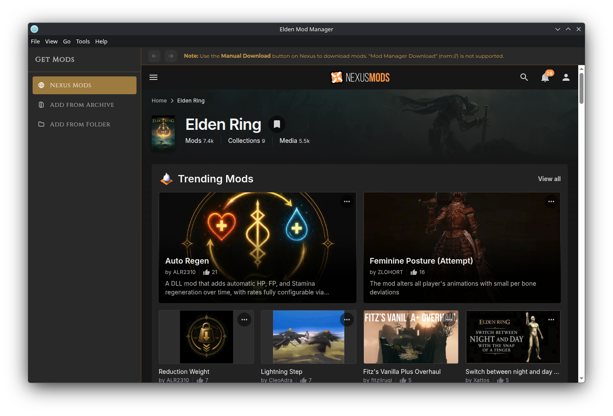
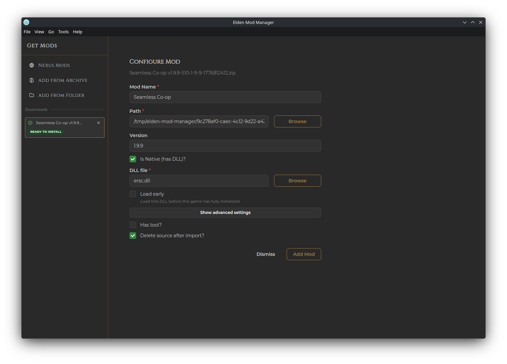

# Get Mods & Nexus Integration

Clicking **Get Mods** on the Mods page opens a separate **Get Mods** window. This window has a sidebar with three sections: Nexus Mods, Add from Archive, and Add from Folder. The main area shows the currently selected section. When a mod is added by any method, an additional entry in the sidebar appears in the **Downloads** section, showing its progress and status.

## Nexus Mods Tab

This is an embedded browser that links directly to the Nexus Mods Elden Ring section, with Back/Forward navigation buttons in the top left corner. Use Nexus Mods as you normally would in a web browser, and when you find a mod you want to add, click the **Manual Download** button on its page. The app will download and extract it automatically, then you can configure it in the **Configure Mod** form (see below).

> **Important:** Use the **Manual Download** button on a mod's Nexus page. The "Vortex" and "Mod Manager Download" buttons (`nxm://` links) are **not** supported.

## Add from Archive

Browse to a mod archive already on your disk (`.zip`, `.7z`, `.rar`, `.tar`, `.gz`, `.bz2`). It's extracted and handed off to the Configure Mod form.

## Add from Folder

Browse to a folder that already contains an extracted mod.

## Configure Mod

However the mod got here, you'll land on the same form before it's added to your library:

- **Mod Name** — pre-filled from the download/Nexus info where possible
- **Path** — read-only, where the extracted mod currently lives
- **Version** — pre-filled from the download/Nexus info where possible
- **Is Native (has DLL)?** — check this for DLL-hook mods. The app tries to auto-detect the `.dll` if there's exactly one in the folder. Also exposes **Load early** and, under "Show advanced settings," the same **Finalizer**/**Initializer** fields described in [Managing Mods](managing-mods.md#mod-actions-menu)
- **Has tool?** — check this if the mod includes a companion executable (randomizer, config utility, etc.). This registers a [Tool](tools.md) linked to the mod, which you can later launch from the mod's actions menu
- **Delete source after import?** — removes the original archive/folder once the mod is copied into your managed mods folder (checked by default for Nexus downloads)

Click **Add Mod** to finish. If a mod with the same name and version is already installed, you'll be asked to change one of them first.

For some well-known mods, several of these fields are filled in automatically once the app recognizes them.

## Notes

- If you have downloads that haven't finished being configured yet, closing the Get Mods window will ask you to confirm — choosing to close anyway **discards them**, deleting their downloaded/extracted files. Finish configuring (or leave the window open) if you want to keep one.
- If you got here from a [profile import](profiles.md#importing-a-profile) with several missing mods queued up, the sidebar shows a **Pending Installs** list — installing each one (via any method) checks it off automatically.
