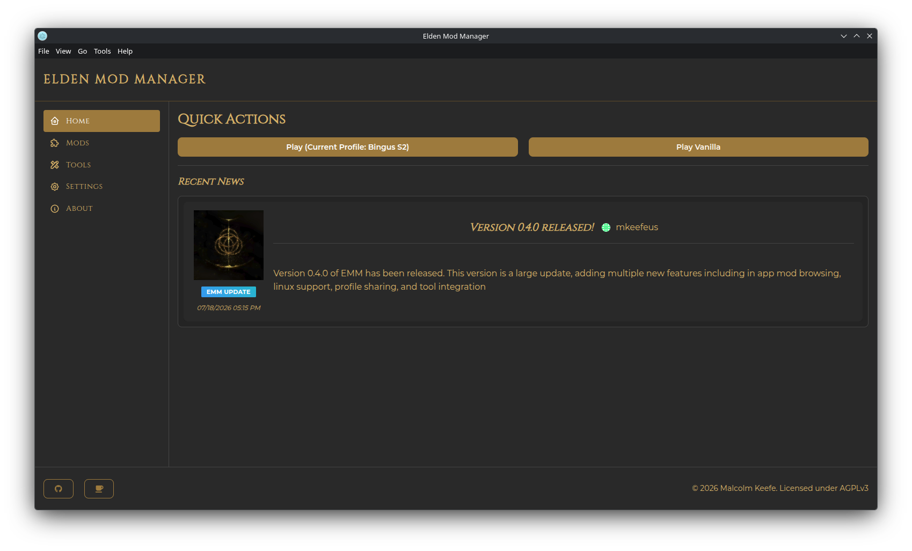

# Getting Started

## The Main Window

The main window has:

- A **navigation sidebar** with five pages: **Home**, **Mods**, **Tools**, **Settings**, and **About**
- A **footer** with links to the project's GitHub and support page, plus an update notice when a new version is out
- A **menu bar** at the very top of the window — see [The Menu Bar](#the-menu-bar) below

## The Menu Bar

- **File** — Quit
- **View** — Reload, Force Reload, and Toggle Developer Tools
- **Go** — quick shortcuts to open the Elden Ring install folder, your Mods folder, the app's own install folder, or its AppData folder, each in your file manager
- **Tools** — Add Elden Mod Manager desktop shortcut (see [Installation](installation.md#desktop-shortcut))
- **Help** — Bug Report and Releases (both open the project's GitHub page), and Collect Logs — see [Troubleshooting](troubleshooting.md) if something goes wrong

## Home Page

The Home page has two **Quick Actions**:

- **Play (Current Profile: ...)** — launches Elden Ring modded, using whatever [profile](profiles.md) is currently active
- **Play Vanilla** — launches unmodded Elden Ring via Steam

Below that is a **Recent News** feed pulled from the Elden Mod Manager blog.

## Your First Mod

A quick end-to-end walkthrough:

1. Go to the **Mods** page and click **Get Mods**. See [Get Mods & Nexus Integration](get-mods-and-nexus.md) for the full flow.
2. Find a mod on the Nexus Mods tab (or add one from a local archive/folder), then fill out and submit the **Configure Mod** form.
3. Back on the **Mods** page, your new mod appears in the list. Check its **Enabled** checkbox to add it to your active profile.
4. Click **Launch Game** to start Elden Ring with the mod loaded.

For everyday mod management — enabling/disabling, load order, editing a mod's settings — see [Managing Mods](managing-mods.md).
