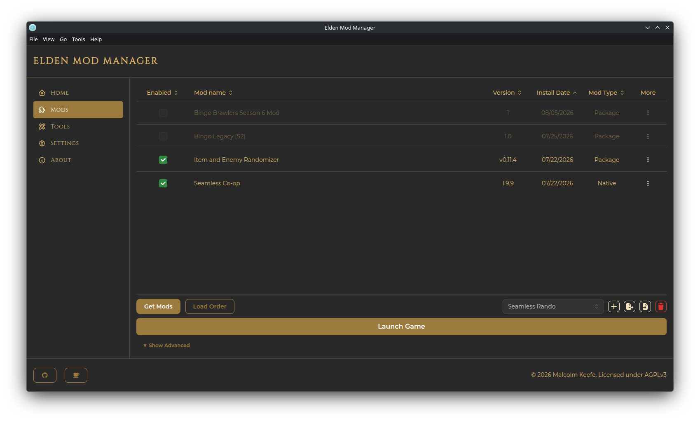

# Elden Mod Manager

Elden Mod Manager is a desktop app for managing mods for **Elden Ring**. It runs on top of [me3](https://github.com/garyttiereny/me3), the mod-loading tool that actually injects mods into the game at launch.

The app keeps your mods in their own managed folder, separate from your Elden Ring install, and gives you:

- A **mod list** where you install, enable/disable, and remove mods
- **Load order** control, including advanced per-mod ordering rules
- **Profiles** — save different mod setups (e.g. one profile per playthrough or character) and switch between them instantly
- A built-in **Get Mods** browser for **Nexus Mods**, plus the ability to add mods from a local archive or folder
- **Tools** management for companion executables that ship alongside some mods (randomizers, config utilities, etc.)
- One-click **launching**, both modded (via me3) and vanilla (via Steam)

## Documentation

- [Installation](installation.md) — requirements, downloading, first-launch setup
- [Getting Started](getting-started.md) — a tour of the app and your first mod install
- [Managing Mods](managing-mods.md) — the mod list, enabling/disabling, editing, load order
- [Get Mods & Nexus Integration](get-mods-and-nexus.md) — browsing Nexus, installing from archives/folders
- [Profiles](profiles.md) — creating, switching, exporting, and importing profiles
- [Tools](tools.md) — managing companion executables
- [Launching the Game](launching-the-game.md) — modded vs. vanilla, launch options
- [Settings & Backup](settings-and-backup.md) — folder paths, launcher settings, exporting/importing app settings
- [Troubleshooting](troubleshooting.md) — common issues and fixes
- [Linux Support](linux.md) — running Windows-only tools via Proton, the Proton launch verb, and other Linux-specific notes

## Requirements

- The **Steam** version of Elden Ring (the only officially supported platform)
- Windows or Linux — macOS is not currently supported
- Nothing else to install — the me3 mod loader is bundled with the app

## Getting Help

Found a bug or have a question? Open an issue on [GitHub Issues](https://github.com/Mkeefeus/Elden-Mod-Manager/issues).
