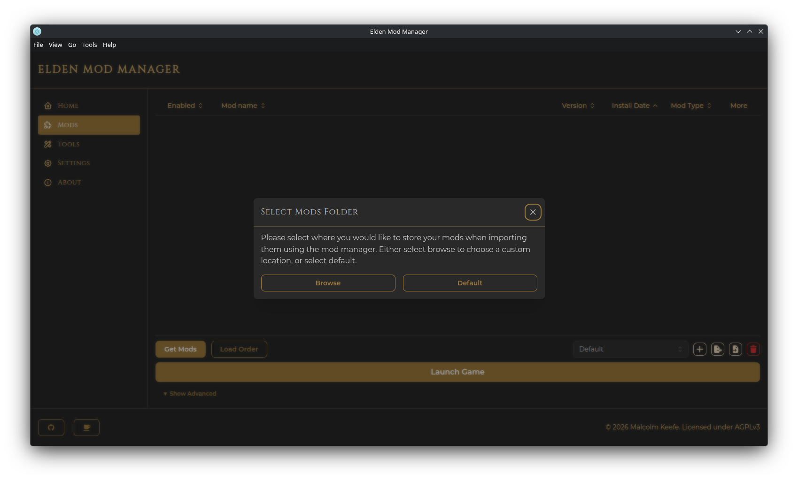
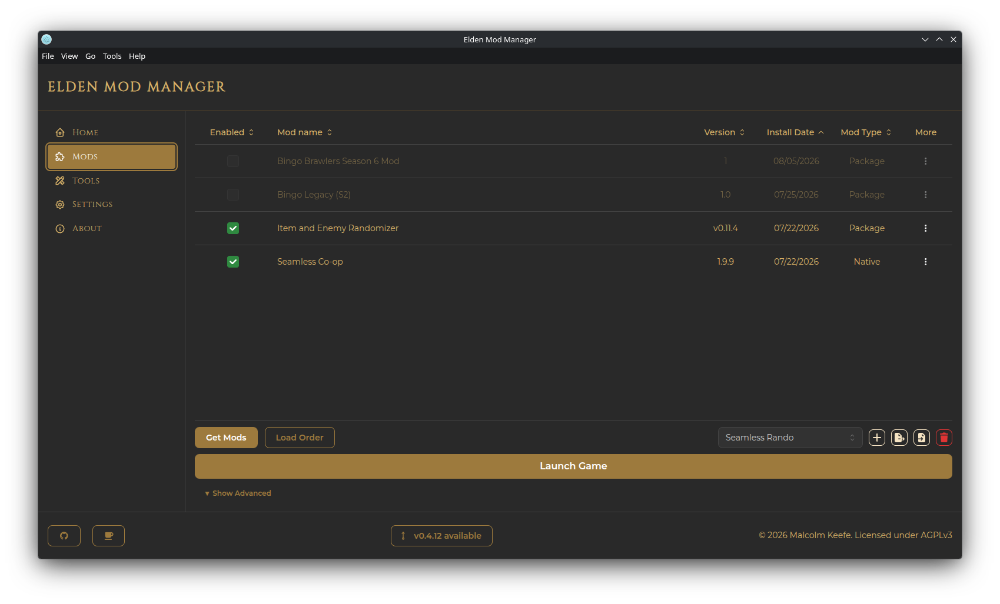

# Installation

## Requirements

- The **Steam** version of Elden Ring. Other storefront versions are not supported.
- **Windows** or **Linux**. macOS is not currently supported. (Linux has a few behavior differences — see [Linux Support](linux.md).)
- No separate install of the [me3](https://github.com/garyttiereny/me3) mod loader is needed — it's bundled with every release.

## Downloading

Go to the [Releases](https://github.com/Mkeefeus/Elden-Mod-Manager/releases) page and download the asset that matches your OS:

| Platform | File |
|---|---|
| Windows | the `Setup.exe` installer, or the portable `.zip` |
| Debian / Ubuntu | `.deb`, or the portable `.zip` |
| Fedora / RHEL | `.rpm`, or the portable `.zip` |
| Other Linux (e.g. Arch) | the portable `.zip` |

## Installing

- **Windows** — run the installer, or extract the `.zip` and run `elden-mod-manager.exe` from wherever you place it.
- **Linux (.deb/.rpm)** — install with your distro's package manager (e.g. `sudo apt install ./elden-mod-manager*.deb` or `sudo dnf install ./elden-mod-manager*.rpm`).
- **Linux (.zip)** — extract it anywhere and run the `elden-mod-manager` executable.

## First Launch

The first time you open the app, you'll be prompted to choose where your **mods folder** should live:

- **Browse** — pick a custom folder anywhere on disk.
- **Default** — use the app's default data folder (under your OS's application data directory, e.g. `.../elden-mod-manager/mods`).

This folder is where the app stores installed mod files. It's kept separate from your actual Elden Ring installation, so nothing is modified in place — me3 loads mods from here at launch.

You can change this location later from the [Settings page](settings-and-backup.md).

## Desktop Shortcut

Neither the installer nor the portable build creates a desktop shortcut for you automatically. To add one, use the app's menu bar: **Tools → Add Elden Mod Manager desktop shortcut**. This creates a `.lnk` shortcut on Windows or a `.desktop` launcher on Linux (added to both your Desktop and your application launcher).

## Updating

- **Windows** — the app checks for updates automatically in the background (roughly every 5 minutes) and will prompt you to restart once a new version has finished downloading.
- **Linux** — there's no automatic update mechanism for the `.deb`/`.rpm`/`.zip` builds. Watch for the footer notice below and reinstall manually when a new version is out.

On any platform, a button also appears in the footer of the main window when a newer release is available — click it to open the release notes.

