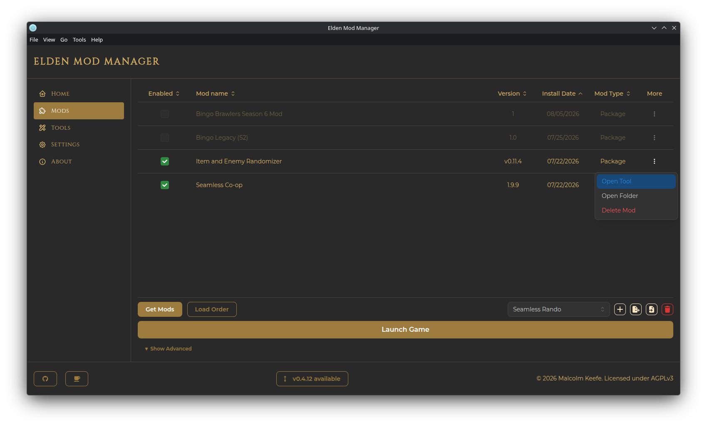
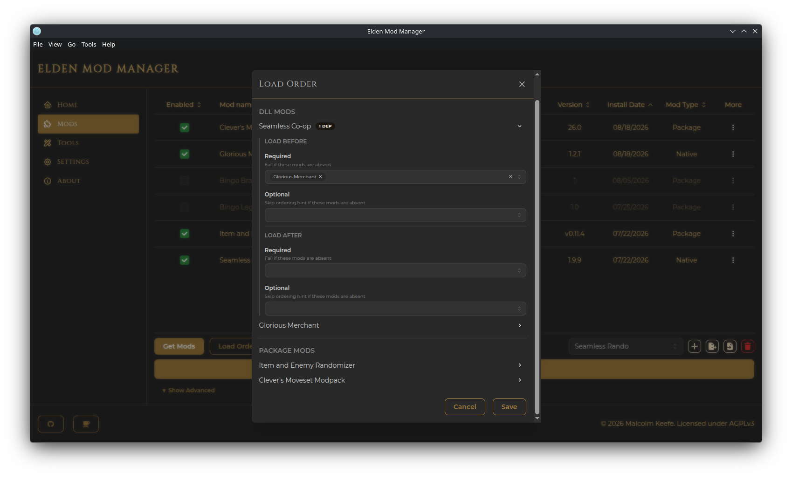

# Managing Mods

## The Mods Page

The Mods page lists every mod you've installed, with columns for:

- **Enabled** — a checkbox controlling whether the mod is part of your *currently active* [profile](profiles.md)
- **Mod name**
- **Version**
- **Install Date**
- **Mod Type** — see [Native vs. Package mods](#native-vs-package-mods) below
- **More** — a per-mod actions menu

Below the table is the toolbar: **Get Mods**, **Load Order**, the profile selector, **Launch Game**, and an **Advanced Settings** section (see [Launching the Game](launching-the-game.md)).

### Installed vs. Enabled

Installing a mod adds it to your library — it doesn't automatically appear in the game. **Enabling** a mod (via its checkbox) adds it to the currently active profile's load order. Different profiles can have different mods enabled from the same shared library, so you can keep a large mod collection installed and only turn on what a given profile needs.

## Native vs. Package Mods

- **Native** mods ship a `.dll` file that hooks directly into the game. (Example: Seamless Co-op)
- **Package** mods are file-replacement/param-edit mods (containing a `regulation.bin` and/or the game's expected mod subfolders. Example: Glorious Merchant).

The Mod Type column tells you which kind each installed mod is; this also affects which options are available in its actions menu and how [Load Order](#load-order) treats it.

## Mod Actions Menu

Click **More** (3 vertical dots) on a mod's row to see:

- **Edit Profile Settings** *(Native mods only, requires the mod to be enabled)* — advanced DLL loading hooks:
  - **Load early** — load this DLL before the game has fully initialized
  - **Finalizer** — a symbol name called when the DLL is queued for unload
  - **Initializer** — run an action after the DLL loads: none, a delay in milliseconds, or a named function symbol

  > **Important:** Only change these if a mod's own instructions tell you to, or you know what you are doing!

- **Edit INI Files** *(only shown if the mod ships `.ini` files)* — opens an in-app text editor, one tab per file, with **Save** / **Save All**
- **Open Tool** *(only shown if a companion tool is linked to this mod)* — launches the linked executable; see [Tools](tools.md)
- **Open Folder** — opens the mod's install folder in your file manager
- **Delete Mod** — removes the mod's files from disk and removes it from every profile's enabled list and load-order rules. **This cannot be undone.**

## Load Order

Click **Load Order** to open the load order editor. It only lists mods that are currently **enabled** in the active profile, split into two independent groups:

- **DLL mods** (Native)
- **Package mods**

Each group is ordered separately — DLL load order doesn't affect package load order or vice versa.

Expand a mod's row (the chevron on the right) to set fine-grained ordering rules against other enabled mods of the same type:

- **Load before / Load after**, each split into:
  - **Required** — the game/mod loader will fail to launch if the referenced mod isn't present
  - **Optional** — the ordering hint is simply skipped if the referenced mod isn't present

These rules are saved per profile. If no mods are enabled yet, you will be prompted to enable at least one first.
