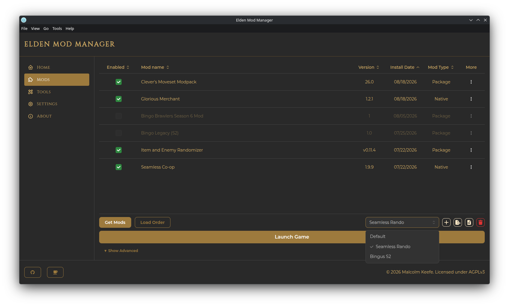
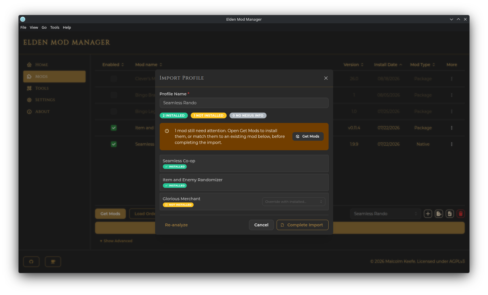

# Profiles

A **profile** is a saved combination of:

- Which installed mods are enabled, and in what load order
- Profile-specific launch settings (save file, online mode, and a few advanced flags — see below)

Only one profile is active at a time — that's what "Launch Game" and the Home page's Play button use. A fresh install starts with a single profile named **Default**.

## Switching Profiles

Use the dropdown in the Mods page toolbar to switch the active profile. The mod list's Enabled checkboxes and Load Order update to reflect whichever profile is now active.

## Creating a Profile

Click the **+** icon next to the profile dropdown, give it a name, and it becomes the active profile immediately. It starts with no mods enabled, but inherits four of the previous profile's launch settings as a starting point: Custom Save File Name, Start Online, Disable Arxan, and Skip Memory Patch. The Linux-only [Override Proton Verb](linux.md#the-proton-launch-verb) setting does *not* carry over — it always starts off on a new profile.

## Deleting a Profile

Click the trash icon to delete the currently active profile (after confirming). A couple of rules:

- The **Default** profile can never be deleted.
- You can't delete the last remaining profile.

## Profile-Specific Settings

Expand **Show Advanced** in the Mods page toolbar to see per-profile launch settings:

- **Custom Save File Name** — override the default save file name (off by default)
- **Start Online** — launch in online mode (off by default — leave this off unless you know what you're doing, since some mods can trigger anti-cheat while online)
- **Disable Arxan** — neutralize Arxan/GuardIT code protection (off by default; some mods/tools require this)
- **Skip Memory Patch** — don't increase the game's memory limits; may affect stability (off by default)
- **Override Proton Verb** *(Linux only)* — use `proton run` instead of `proton waitforexitandrun`, needed when you want to run another app alongside the game (see [Linux Support](linux.md#the-proton-launch-verb) for details)

## Exporting a Profile

Click the export icon next to the profile dropdown to save the active profile to a `.json` file — its mod list, load order rules, and launch settings (Custom Save File Name, Start Online, Disable Arxan, and Skip Memory Patch). Useful for sharing a modlist with someone else or backing one up.

> Note: the Linux-only [Override Proton Verb](linux.md#the-proton-launch-verb) setting is not included in profile export/import — set it again by hand after importing, if you need it.

## Importing a Profile

Click the import icon and browse to a previously exported profile `.json` file. The app analyzes it against your currently installed mods and shows each mod's status:

- **Installed** (teal) — already matched to a mod you have
- **Not Installed** (yellow) — has Nexus info, so the app can identify it, but you don't have it installed
- **No Nexus Info** (gray) — the app can't identify it automatically; you'll need to match it manually

For anything not already installed, you can either:

- Use the dropdown next to that mod to manually match it to one of your existing installed mods, or
- Click **Get Mods** to jump to the [Get Mods window](get-mods-and-nexus.md), pre-loaded with a queue of the outstanding mods. As you install each one, this modal automatically re-checks and updates.

Give the imported profile a name (it'll auto-suffix a number if that name is already taken) and click **Complete Import**. Any mods you never matched or installed are simply left out of the new profile — you can add them later like any other mod.
