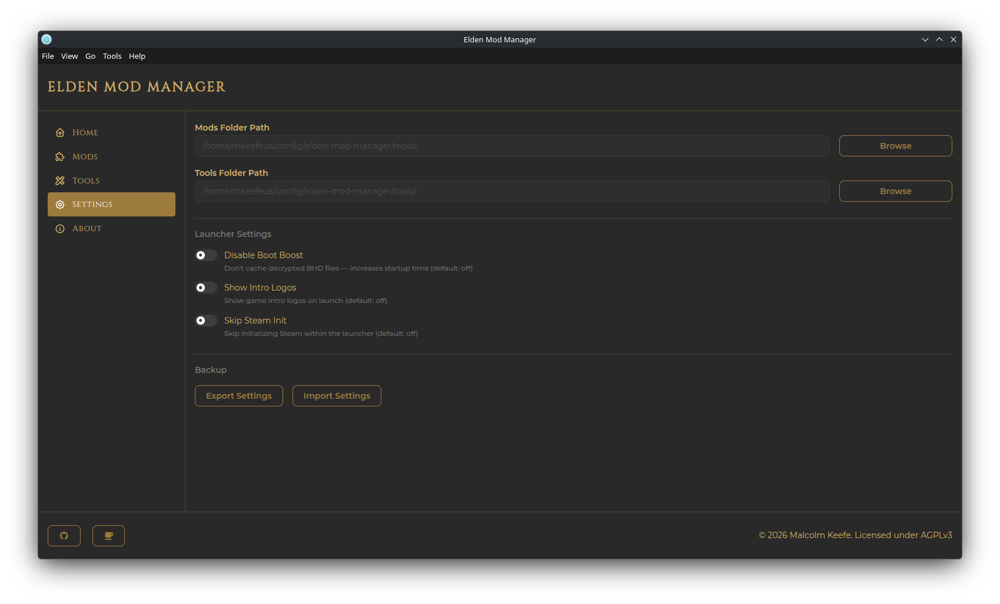

# Settings & Backup

## Folder Paths

- **Mods Folder Path** — where installed mod files live
- **Tools Folder Path** — where managed [tool](tools.md) files live

Both are shown read-only with a **Browse** button. Changing either one **moves your existing files** to the new location automatically — the destination folder must be empty first.

> **Tip:** You can jump straight to these folders (plus the Elden Ring install folder and the app's AppData folder) from the **Go** menu in the menu bar — see [Getting Started](getting-started.md#the-menu-bar).

## Launcher Settings

These apply globally, no matter which profile is active:

- **Disable Boot Boost** — don't cache decrypted game files; increases every startup's load time (off by default)
- **Show Intro Logos** — show the game's intro logos on launch (off by default)
- **Skip Steam Init** — skip initializing Steam within the launcher (off by default)

## Backup

- **Export Settings** — saves your mods/tools folder paths and launcher toggles to a `.json` file.
- **Import Settings** — loads those back in. If an imported path doesn't exist on the current machine, that particular path is skipped (with a warning) rather than applied — this restores *configuration*, not the mod/tool files themselves.

This is different from [profile export/import](profiles.md#exporting-a-profile), which covers a single profile's mod list, load order, and per-profile launch settings rather than app-wide paths and toggles.
