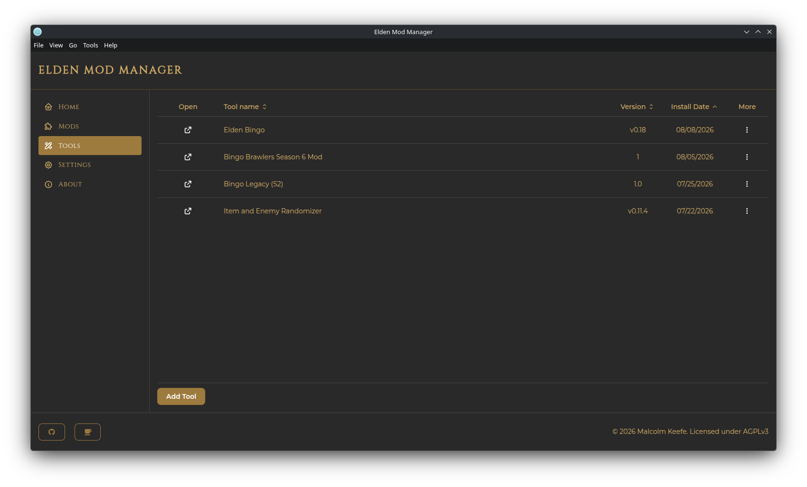
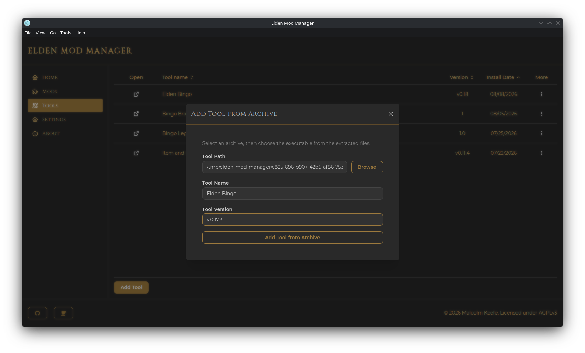

# Tools

**Tools** are companion executables associated with your mods — config/randomizer utilities, ertool, and the like. The app keeps managed copies of them in its own tools folder (see [Settings](settings-and-backup.md)).

## Automatic Registration

When you [add a mod](get-mods-and-nexus.md#configure-mod) via Get Mods and check **Has tool?**, a Tool entry is created and linked to that mod automatically. You can then launch it from that mod's actions menu (**Open Tool**) on the Mods page, or from the Tools page.

> **Note:** Deleting a mod that has a linked tool also deletes that tool.

## Adding a Tool Manually

On the Tools page, click **Add Tool**, then choose:

- **From File** — pick the executable directly. You can optionally copy it into the app's managed tools folder (and delete the original afterward).
- **From Archive** — pick an archive; it's extracted, then you pick the executable from inside it.

Fill in a **Name** and **Version** (a tool with the same name and version combination can't be added twice).

## Launching a Tool

Click the icon in the **Open** column on the Tools page, or use **Open Tool** from a linked mod's actions menu on the Mods page.

On Linux, a Windows-only tool (a `.exe` file) is launched automatically through Proton, using Elden Ring's own Proton prefix — see [Linux Support](linux.md#running-windows-only-tools) for how this works and what it requires.

## Editing or Removing a Tool

Use the **More** menu on a tool's row:

- **Edit Tool** — change its name, version, or path
- **Open Containing Folder** — opens the tool's location in your file manager
- **Remove Tool** — removes the entry, with an option to also delete its files from disk